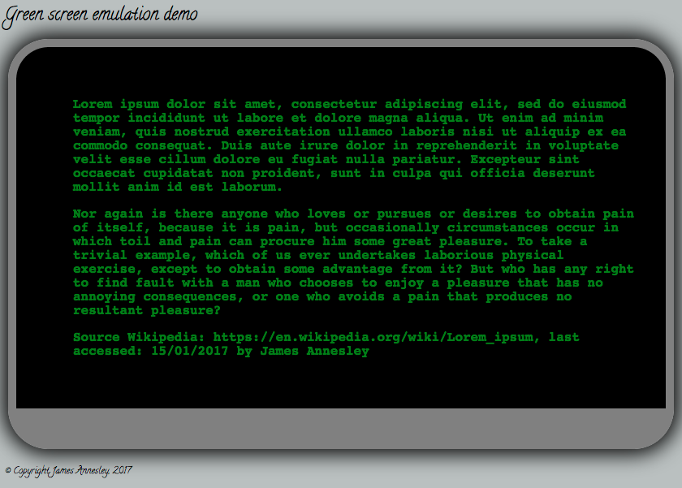

# jsGreenScreen
A JavaScript old fashioned green screen monitor emulator. Text is read from a JSON file and each sentence is output letter by letter in a sequential manner - as an old computer monitor would do. 

To run this locally - download repository and load index.html in your browser. Edit greenscreen.json as required. See below Screen grab of the mobile page with a random preset:
